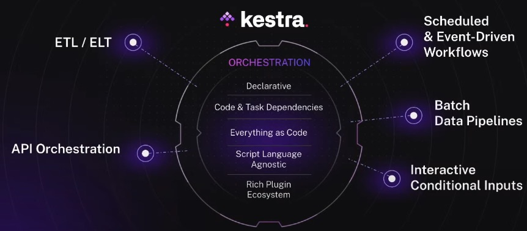
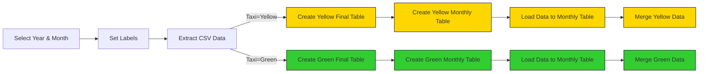
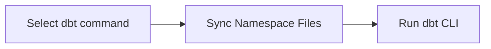
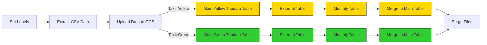

# Kestra-project
## Build Data Pipelines with Kestra
Build ETL pipelines for Yellow and Green Taxi data from NYC’s Taxi and Limousine Commission (TLC) by:

1. Extracting data from [CSV files](https://github.com/DataTalksClub/nyc-tlc-data/releases).
2. Loading it into Postgres or Google Cloud (GCS + BigQuery).
3. Exploring scheduling and backfilling workflows.


## [Kestra](https://github.com/kestra-io/kestra) 
Kestra is an all-in-one automation and orchestration platform. 



## 1. Env setup: 
- docker-compose.yml defines setup for multi-service application: Kestra, Postgres and pgAmin.
- Modify pluginDefaults in config yml, corrected postgres db connection.
```bash
docker compose up -d
```
http://localhost:8080 to launch kestra.
http://localhost:9000 to launch pgAdmin.

## 2. Create ETL scripts:
- The flow will extract CSV data partitioned by year and month, create tables, load data to the monthly table, and finally merge the data to the final destination table.


- Add extra columns: uniqueID by using md5 hash to general same uniqueID with same data even in different files and source filename.
- Trucate staging table when we merge to tripdata table. (different from DROP table)
- Merge data to final table without duplicataion.
- Remember to create task to purge all output files. 

## 3. Execute ETL scripts to load data to Postgres, monitored at pgAdmin:
- Add flows using Ketra's API, run the commands below:
```bash
curl -X POST http://localhost:8080/api/v1/flows/import -F fileUpload=@flows/02_postgres_taxi.yaml
```
- Select year and month on dropdown menu on Kestra to load data to Postgres DB and view in on pgAmin.

## 4.Use schedule and backfill to automate pipelines in Kestra:
- Modify Input and Variables to use schedule. 
- To backfill the missed executions, go to the Triggers tab.
- Set concurrency to 1, to prevent multiple flows writing to staging table, truncating table while another flow trying to create uniqueID. 

## 5. Use dbt in Kestra to transform data after load to table:
- Set up dbt workflows in Kestra.
- After raw data ingested to local postgres database, use dbt to transform data in a good format.
- Update config file setting:
```bash
dev:
    type: postgres
    host: host.docker.internal
```
- The flow syncs the dbt models from Git to Kestra and run the `dbt build`.


## 6. Move ETL pipeline in Kestra to Google Cloud Platform using GCS and BigQuery:
Load the same Yellow and Green Taxi data to Google Cloud Platform (GCP) using: Google Cloud Storage (GCS) as a data lake and BigQuery as a data warehouse.
- Set up Google Cloud: service account, projectID, local region and bucket. 
- Create GCP store key value to Kestra as KV store.
- Upload CSV file to data lake: Google Cloud Storage.
- Use BigQuery to create tables, merge data to final table.
- Use BigQuery to process data and run query. 
- With cloud, we can work on bigger datasets. 
- Use trigger to Schedule & Backfill to upload data to GCS for BigQuery to use.



## 7. Use dbt with BigQuery in Kestra:
- Set up dbt workflow in Kestra.

## 8. Deploy Kestra to the cloud using Google Cloud & use git sync plugin:
- Use compute engine to run Kestra or Postgres.
- Use GitHub action to synchronize data. 
- push task: push flows and namespace files in local environment. 
- sync task: sync those flows from our git repo to Kestra in production instance.