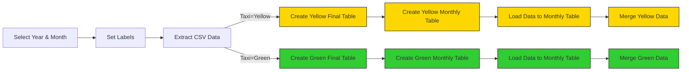

# Kestra-project
## Build Data Pipelines with Kestra
Build ETL pipelines for Yellow and Green Taxi data from NYC’s Taxi and Limousine Commission (TLC) by:

1. Extracting data from [CSV files](https://github.com/DataTalksClub/nyc-tlc-data/releases).
2. Loading it into Postgres or Google Cloud (GCS + BigQuery).
3. Exploring scheduling and backfilling workflows.


# [Kestra](https://github.com/kestra-io/kestra) 
Kestra is an all-in-one automation and orchestration platform. 


# 1. Env setup: 
docker-compose.yml defines setup for multi-service application: Kestra, Postgres and pgAmin.
- Modified pluginDefaults in config yml, corrected postgres db connection.
```bash
docker compose up -d
```
http://localhost:8080 to launch kestra.
http://localhost:9000 to launch pgAdmin.

# 2. Create ETL scripts:
The flow will extract CSV data partitioned by year and month, create tables, load data to the monthly table, and finally merge the data to the final destination table.


- Add extra columns: uniqueID by using md5 hash to general same uniqueID with same data even in different files and source filename.
- Trucate staging table when we merge to tripdata table. (different from DROP table)
- Merge data to final table without duplicataion.
- Remember to create task to purge all output files. 

# 3. Execute ETL scripts to load data to Postgres, monitored at pgAdmin:
Add flows using Ketra's API, run the commands below:
```bash
curl -X POST http://localhost:8080/api/v1/flows/import -F fileUpload=@flows/02_postgres_taxi.yaml
```
- Select year and month on dropdown menu on Kestra to load data to Postgres DB and view in on pgAmin.

# 4. 
